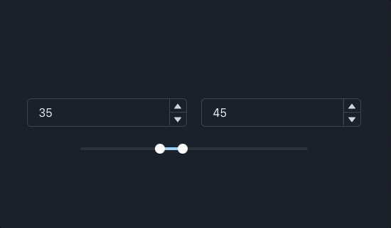

<h1 align="center">chakra-slider-component</h1>

> range slider controller component with number inputs made with chakra-ui



## Install

```sh
npm install
```

## Usage

```sh
npm run dev
```


## Fernando Belotto

* Website: https://fernandobelotto.dev
* Github: [@fernandobelotto](https://github.com/fernandobelotto)
* LinkedIn: [@fernandobelotto](https://linkedin.com/in/fernandobelotto)